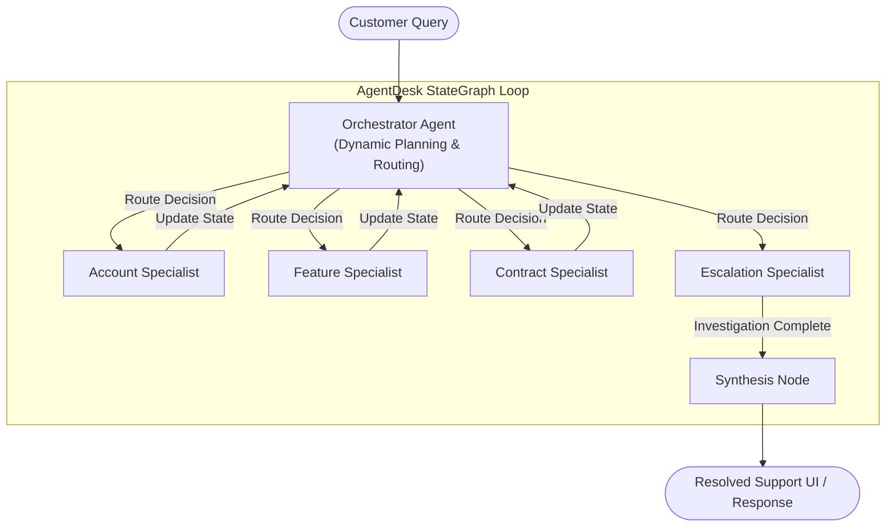

# AgentDesk
### Multi-Agent Customer Support Intelligence System

**Author**: Harsh Tailor  
**Role**: AI Engineer  

---

## System Intuition & Project Goal

In enterprise SaaS ecosystems, customer support tickets are rarely solved by single-step database lookups. Instead, they require multi-hop reasoning across disjointed software silos: billing subscriptions, contract agreements (SLAs), feature flags, API documentation, and escalation protocols. 

A single monolithic LLM agent with access to dozens of tools often suffers from:
1. **Context Window Exhaustion**: Getting bogged down by excessive API responses and system logs.
2. **Tool-Use Hallucinations**: Making incorrect or unauthorized tool executions.
3. **Contradiction Blunders**: Failing to reconcile differences between documentation (which might say a feature is "available to all") and real-time database configurations.

**AgentDesk** solves this by implementing a **hub-and-spoke multi-agent system** orchestrated by a centralized state machine. A central **Orchestrator** agent dynamically plans the investigation and routes queries to dedicated specialist agents. These specialists handle domain-specific reasoning (Account, Feature, Contract, Escalation) and write findings back to a unified memory state, which the Orchestrator synthesizes into a final resolution.

---

## Architecture & Flow

AgentDesk utilizes a state-driven dynamic routing loop. Every specialist agent performs its action, updates the global state, and returns control to the Orchestrator for the next routing decision.



### Specialist Sub-Agents
* **Account Specialist**: Queries user subscription status, billing health, seat counts, and lifecycle stages.
* **Feature Specialist**: Reconciles user query features against configuration databases and documentation files.
* **Contract Specialist**: Validates SLA priority response windows and account contract terms.
* **Escalation Specialist**: Automates the handoff and generates structured support tickets if issues cannot be resolved programmatically.

---

##  Key AI Engineering Pillars

### 1. State-Machine Orchestration (LangGraph)
The system is built on **LangGraph**, representing the multi-agent flow as a directed cyclic graph. Instead of hardcoded routing logic, the graph's nodes share a centralized `SupportState` memory object. This enforces clean separation of concerns: specialists do not need to know about each other; they only read from and write to the shared context.

### 2. Cognitive Planning & Re-Routing
Rather than executing a static sequence of actions, the **Orchestrator** acts as a dynamic planner. Based on the initial query, it generates an investigation plan. After each specialist agent executes and saves its findings (e.g. finding that the customer's account is suspended), the Orchestrator re-evaluates the state and can dynamically alter the plan—avoiding unnecessary tool calls and saving latency and token costs.

### 3. Structural Conflict Detection & Resolution
A common issue in customer support is mismatched information (e.g., public documentation claims a feature is free, but the backend DB requires a Pro plan). AgentDesk contains dedicated logic within the Feature Agent to compare DB state with documentation state. If a conflict is discovered, it is explicitly flagged in the global context. The system is designed with a strict prioritization rule: **production database state always overrides generic documentation**.

### 4. Enterprise-Grade Tool Resiliency
All backend APIs and databases are wrapped in a robust simulation layer that mimics real-world conditions:
* **Latency Simulation**: Simulates database query overhead.
* **Failure Injection**: Incorporates random failure rates to test system behavior under stress.
* **Graceful Degradation**: Agents are built with retry mechanisms and safe fallback logic. If a database query fails, the agent reports a fallback default to the Orchestrator instead of crashing the process.

### 5. Production Observability & Telemetry
The system is instrumented with **Langfuse** for detailed LLM monitoring. Each run records:
* Exact tool parameters and outputs.
* Token count and prompt cost.
* LLM latency.
* Routing pathways across nodes.

This ensures the agent workflows can be audited, debugged, and optimized continuously.

---

## Tech Stack
* **LLM Backbone**: LLaMA-3.3-70B-Versatile (via Groq)
* **Agent Framework**: LangGraph
* **Web Services**: Flask (Backend API), React (Interactive Frontend)
* **Observability**: Langfuse
* **Testing**: Python `unittest` framework

---

## Testing & Evaluation Suite

AgentDesk features an automated **Integration Regression Testing Harness** located in [tests/test_scenarios.py].

### 1. Robust 10-Scenario Dataset
Tests are driven by a production-style golden dataset in [query_results.json](results/query_results.json), containing **10 highly challenging test cases** targeting:
*   **Simple Configuration Scenarios**: Dark mode parameters.
*   **SLA breaches**: Latency calculations (e.g. 10-day outage credits against daily MRR constraints).
*   **Overage restrictions**: Overage seat counting (15 used seats vs 10 seat capacity bounds).
*   **Billing Security**: Action routing blocks for suspended billing accounts.
*   **Database Exceptions**: Graceful handling of unknown/empty database profiles.

### 2. Dynamic Isolated Execution
Rather than running in a single fragile thread, the suite dynamically binds each scenario as an **independent test case** on startup. If a single scenario fails or encounters rate limits, the remaining 9 cases run completely, presenting a comprehensive evaluation report.

### 3. API Resilience & Backoff
To handle cloud provider rate limits (such as Groq's daily token limits), the test suite incorporates **exponential backoff retry mechanisms**. If a `429 RateLimitError` is caught, the harness waits and retries (increasing pauses from 6s to 20s+) before registering a failure.

### 4. Running the Tests
To run the evaluation suite locally:
```bash
python3 -m unittest tests/test_scenarios.py
```

---
